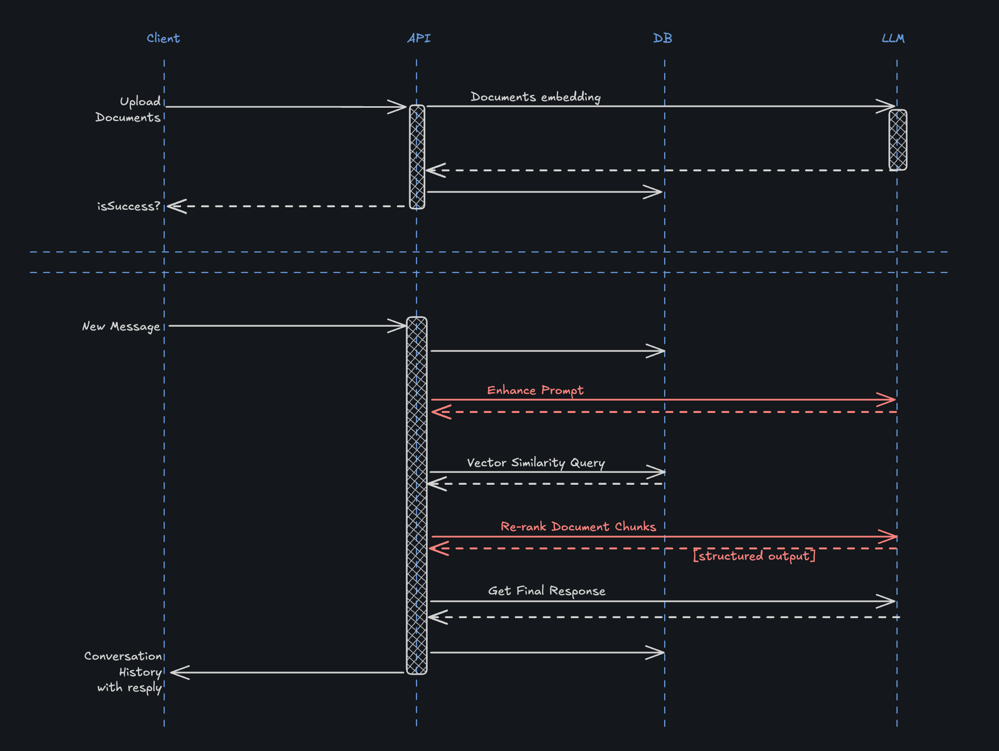

# RAG System Conceptual Design

## Overview

This document outlines the conceptual design of our Retrieval-Augmented Generation (RAG) chat application. The system combines document processing, vector embeddings, and large language models to provide contextually relevant responses based on user-uploaded documents.

## Approach

I tried to choose the simpler technologies to showcase understanding of the underlying concepts, separation of concerns as well as streamlining the development of this application as a POC. For a more detailed explanation review the [architectural design](/architectural-decisions.md) document:

- **Hono.js** for the api
- Vercel **AI SDK** for LLM integration
- OpenAI with `gpt-4o-mini` as the model for al the requests
- PostgresSQL + **PGVector** extension for vector storage and similarity search
- **React** + **Tanstack Router** + **Tanstack Query** for the Frontend

### Flow Overview

1. **Document Upload & Processing**:
   - Users upload documents
   - Documents are split into chunks and embedded into vector space (OpenAI Ada model, 1536)
   - Embeddings are stored in a PostgreSQL database with pgvector extension

2. **Conversational Query Processing**:
   - User sends a message
   - The system enhances the prompt
   - Vector similarity search identifies relevant document chunks
   - Retrieved chunks are reranked by relevance
   - A final response is generated using the most relevant context

## Key Components Explained

### Document Indexing & Embedding

Documents uploaded by users undergo a process of:

1. **Chunking**: Large documents are split into smaller chunks using the `RecursiveCharacterTextSplitter`. This breaks down documents into manageable pieces while attempting to preserve semantic meaning.

2. **Overlapping**: Chunks have a defined overlap to ensure context isn't lost at chunk boundaries. This prevents information from being missed if it spans across the artificial boundaries created by chunking.

3. **Embedding**: Each chunk is converted into a high-dimensional vector (embedding) using a text embedding model. These embeddings capture the semantic meaning of the text.

4. **Storage**: The chunks and their embeddings are stored in the database, allowing for efficient vector-based similarity searches.

### Prompt Enhancement

When a user submits a query, the system first applies prompt enhancement:

1. The original query and conversation history are analysed
2. An LLM generates an improved version of the query that:
   - Clarifies ambiguities
   - Adds missing context
   - Bridges the gap between casual user language and formal document language
   - Makes the query more specific and targeted

This improves retrieval quality by making the query more semantically aligned with the document content.

### Vector Similarity Search

To find relevant document chunks:

1. The enhanced prompt is converted to a vector embedding
2. A similarity search is performed in vector space using cosine distance
3. Documents with similarity scores above a threshold are retrieved
4. The top K most similar documents are selected for further processing

Cosine distance measures the angle between two vectors, providing a metric of semantic similarity that's independent of vector magnitude.

### Document Chunk Reranking

The initially retrieved document chunks undergo reranking:

1. Another LLM evaluates each chunk for relevance to the query
2. Each chunk receives a relevance score from 0-10
3. Chunks are reordered based on these scores
4. Low-scoring chunks may be filtered out
5. The result is a refined set of chunks most relevant to the user's query

Reranking addresses limitations of vector similarity by applying more sophisticated relevance judgments.

### Final Response Generation

The system generates the final response by:

1. Constructing a prompt with the reranked document chunks as context
2. Including the conversation history and enhanced query
3. Using an LLM to generate a response that directly addresses the user's query
4. The response is returned to the user and stored in the conversation history

## Glossary

- **RAG (Retrieval-Augmented Generation)**: A technique that enhances LLM outputs by retrieving relevant information from external knowledge sources.

- **Document Chunking**: The process of breaking down large documents into smaller, manageable pieces for processing and retrieval.

- **Chunk Overlap**: The number of characters or tokens shared between adjacent chunks to maintain context across chunk boundaries.

- **Embedding**: A numerical vector representation of text that captures its semantic meaning in a high-dimensional space.

- **Vector Similarity**: A measure of how similar two vectors are to each other, typically calculated using metrics like cosine similarity.

- **Cosine Distance/Similarity**: A measure that calculates the cosine of the angle between two vectors, ranging from -1 (opposite direction) to 1 (same direction). In text embeddings, higher values indicate greater semantic similarity.

- **Top-K Retrieval**: The process of retrieving the K most similar documents or chunks based on a similarity metric.

- **Prompt Enhancement**: The process of improving a user's original query to make it more effective for retrieval and response generation.

- **Reranking**: A second-stage ranking process that applies more sophisticated criteria to refine the order of retrieved documents.

- **pgvector**: A PostgreSQL extension that enables vector similarity search operations.

- **Similarity Threshold**: A minimum similarity score value that retrieved documents must exceed to be considered relevant.

- **Vector Space**: The high-dimensional mathematical space where text embeddings are represented and where similarity operations occur.

- **Semantic Search**: Search based on meaning rather than keywords, enabled by vector embeddings.

- **Structured Output**: Responses generated in a specific format (like JSON) to ensure consistency and machine readability.
